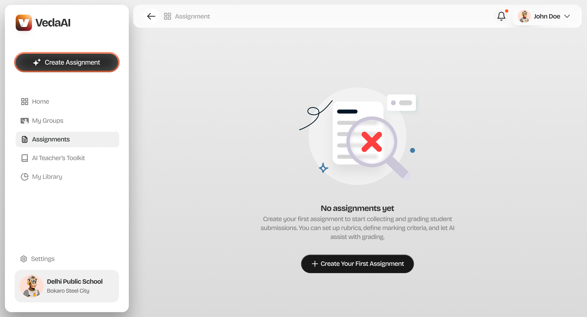
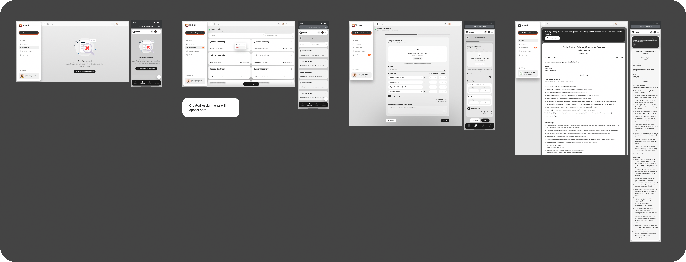
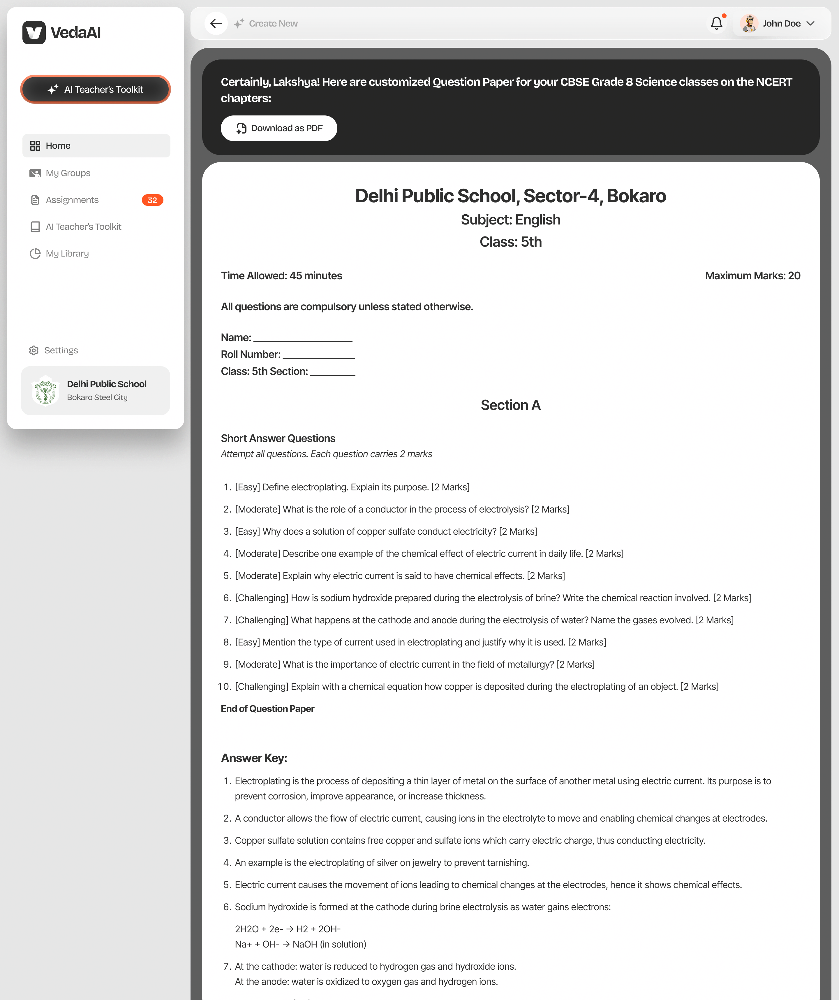
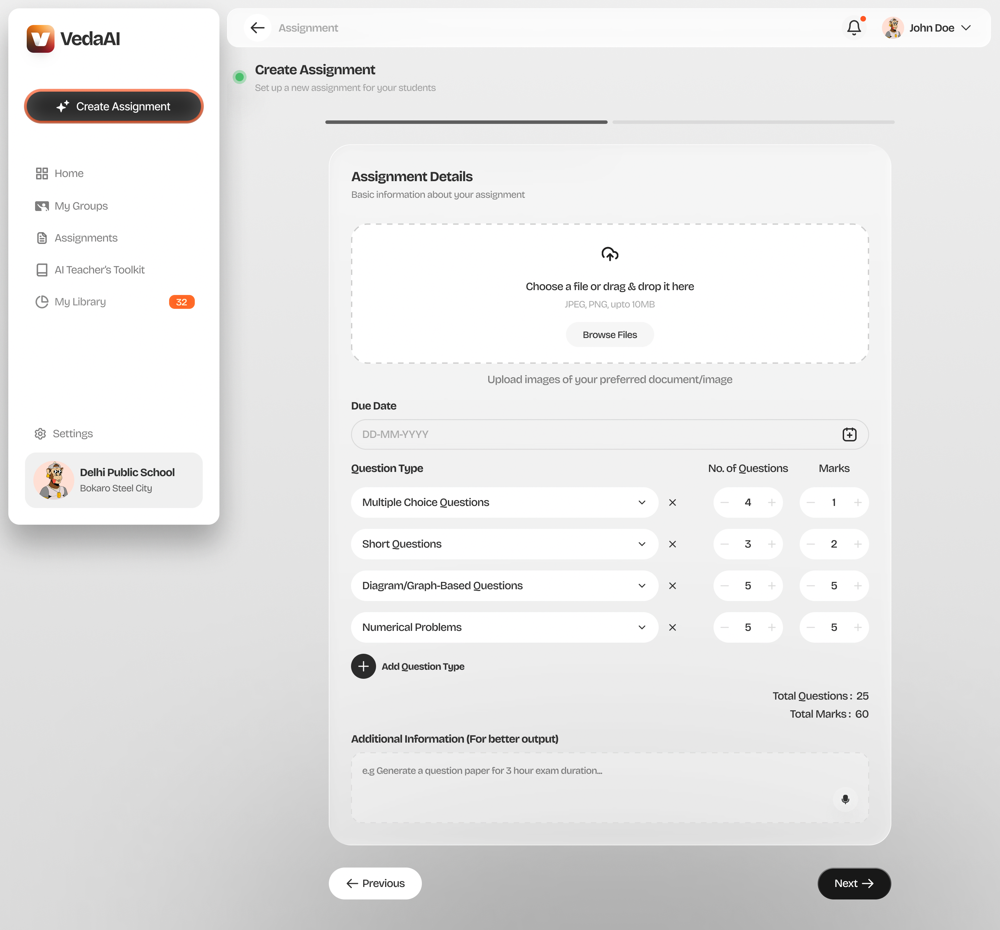
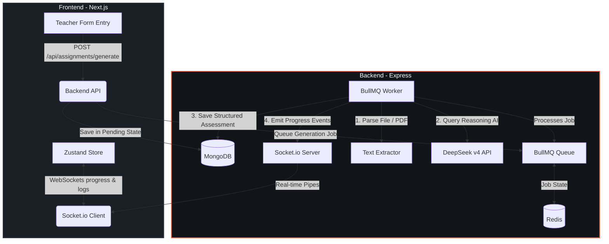

# <p align="center"><br/>VedaAI - AI Assessment Creator</p>

<p align="center">
  
  
  
  
  
</p>

<p align="center">
  A state-of-the-art, full-stack AI-powered assessment creator designed for educators. Compile beautiful, print-ready, double-column exam papers with custom marking criteria, collapsible answer keys, and real-time generation feedback in seconds.
</p>

---

## ✨ UI/UX Preview

Here is a glimpse of the high-fidelity UI designed to match premium academic styling guidelines:

| 📋 Empty State Dashboard | ⚙️ Creation Flow (Step-by-step) |
|---|---|
|  |  |

| 📄 Generated Assessment Output | 📂 Upload Material Section |
|---|---|
|  |  |

---

## 🚀 Core Features

- **🧠 DeepSeek v4 AI Reasoning:** Dynamically extracts core concepts from uploaded files (PDF/TXT) and structures questions directly aligned with class grades and subject contexts.
- **⚡ Real-Time Progress Logs:** Integrated Socket.io terminal output directly pipes BullMQ worker progress (e.g. *"Parsing PDF"*, *"Querying DeepSeek"*, *"Generating Answer Key"*) with a 0-100% reactive progress tracker.
- **📄 Print-Ready Server-Side PDF:** Automatically generates standard two-column exam papers on the server using `pdfkit` featuring custom metadata headers, difficulty badges, and student info blanks.
- **🔑 Collapsible Answer Key:** Renders separate, clean solution keys under the question sheet for easy grading.
- **🔄 Real-Time Regeneration:** Instantly wipes, cues a new background worker task, and updates the layout dynamically.

---

## 🏗️ Architecture & Technology Stack

VedaAI is structured as a full-stack monorepo:

| Component | Technology | Purpose |
|---|---|---|
| **Frontend** | Next.js (App Router) + TS | Fast, reactive interface with static/dynamic layouts. |
| **State** | Zustand | Manages multi-step generation forms, job queues, and dashboard states. |
| **Styling** | Vanilla CSS (CSS Modules) | Custom design system built with smooth 3D rounded pills and glassmorphism. |
| **Backend** | Express + TypeScript | Rest API and WebSocket hub managing queues and MongoDB transactions. |
| **Job Queue** | BullMQ + Redis | Asynchronous background processing of AI prompts and PDF parsing. |
| **Database** | MongoDB + Mongoose | Persists assignments, question structures, and metadata. |
| **Real-time** | Socket.io | Pipes active logs from background workers to the client. |

---

## 🔄 End-to-End Workflow



---

## 🛠️ Setup Instructions

### Prerequisites
Ensure you have the following installed on your machine:
- **Node.js** (v18+ recommended)
- **MongoDB Community Edition**
- **Redis Server**

---

### Step 1: Start Database Services
If you are on macOS and use Homebrew, boot your local MongoDB and Redis instances:
```bash
brew services start redis
brew services start mongodb/brew/mongodb-community@7.0
```

---

### Step 2: Backend Setup
1. Navigate to the backend directory:
   ```bash
   cd backend
   ```
2. Install npm packages:
   ```bash
   npm install
   ```
3. Ensure a `.env` file exists at the root of `backend/` with the following configuration:
   ```env
   PORT=5001
   MONGODB_URI=mongodb://127.0.0.1:27017/vedaai
   REDIS_HOST=127.0.0.1
   REDIS_PORT=6379
   FRONTEND_URL=http://localhost:3000
   ANTHROPIC_API_KEY=your_api_key_here
   ANTHROPIC_BASE_URL=https://opencode.ai/zen
   ANTHROPIC_MODEL=deepseek-v4-flash-free
   ```
4. Start the Express development server:
   ```bash
   npm run dev
   ```

---

### Step 3: Frontend Setup
1. Open a new terminal tab and navigate to the frontend directory:
   ```bash
   cd frontend
   ```
2. Install npm packages:
   ```bash
   npm install
   ```
3. Ensure a `.env.local` file exists at the root of `frontend/` containing:
   ```env
   NEXT_PUBLIC_API_URL=http://localhost:5001/api/assignments
   NEXT_PUBLIC_SOCKET_URL=http://localhost:5001
   ```
4. Start the Next.js development server:
   ```bash
   npm run dev
   ```
   *The application will boot up locally at [http://localhost:3000](http://localhost:3000).*

---

## 🧪 Verification & Features Testing

1. **Dashboard Empty State:** Open `http://localhost:3000` to inspect the clean empty dashboard card and the 3D-styled user profile badge.
2. **Creation Form:** Click **+ Create Assignment**, specify grade/subject details, set questions with reactive steppers, and upload a `.pdf` or `.txt` revision document.
3. **Websocket Logs:** Click **Generate**. A full-screen progress modal will pop up displaying real-time execution steps directly piped from the BullMQ background worker.
4. **Assessment Sheet:** When completed, you are redirected to `/output/[id]` which displays the sheet styled like a physical exam page.
5. **Answer Key:** Scroll to the bottom to verify the collapsible answer key section.
6. **PDF Download:** Click **Download as PDF** to generate and download a perfectly aligned, print-ready document.
7. **Regenerate:** Use the action bar to trigger real-time regeneration.
